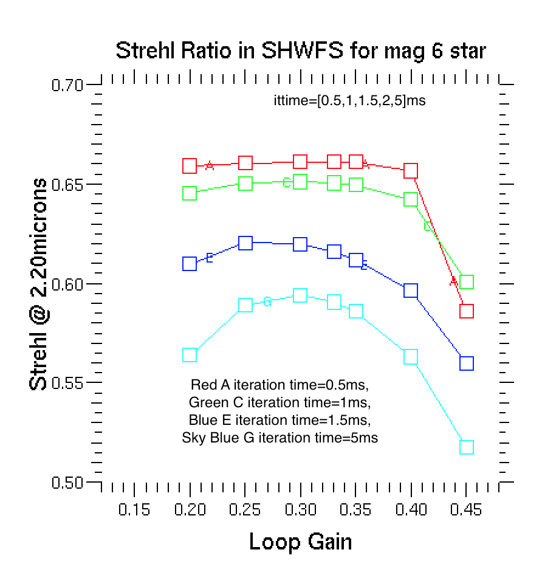
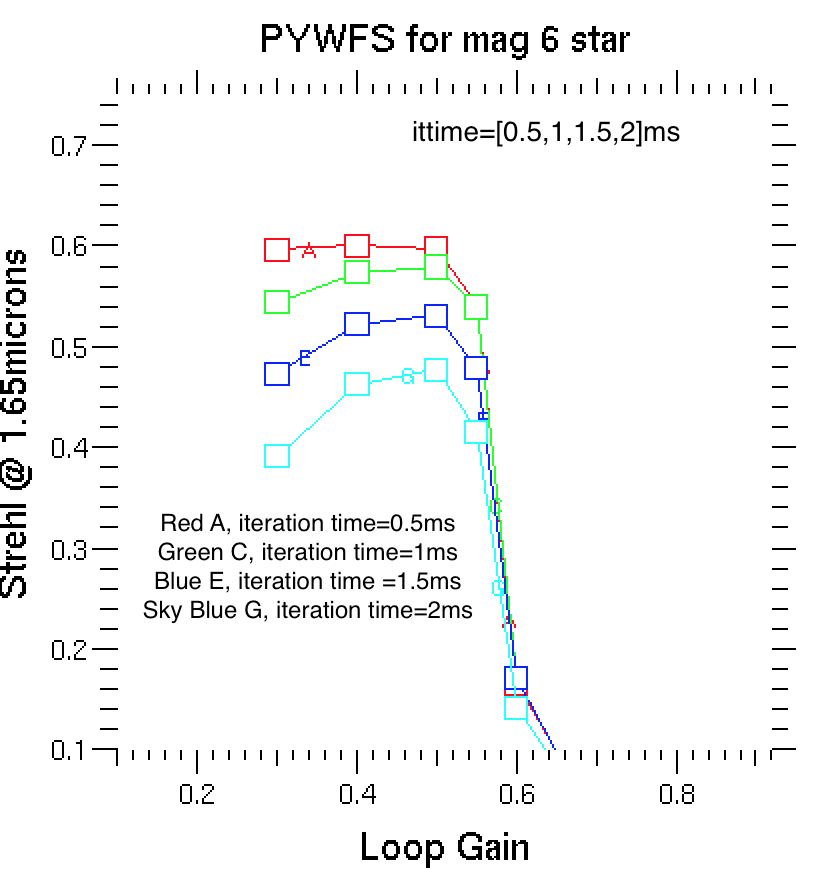
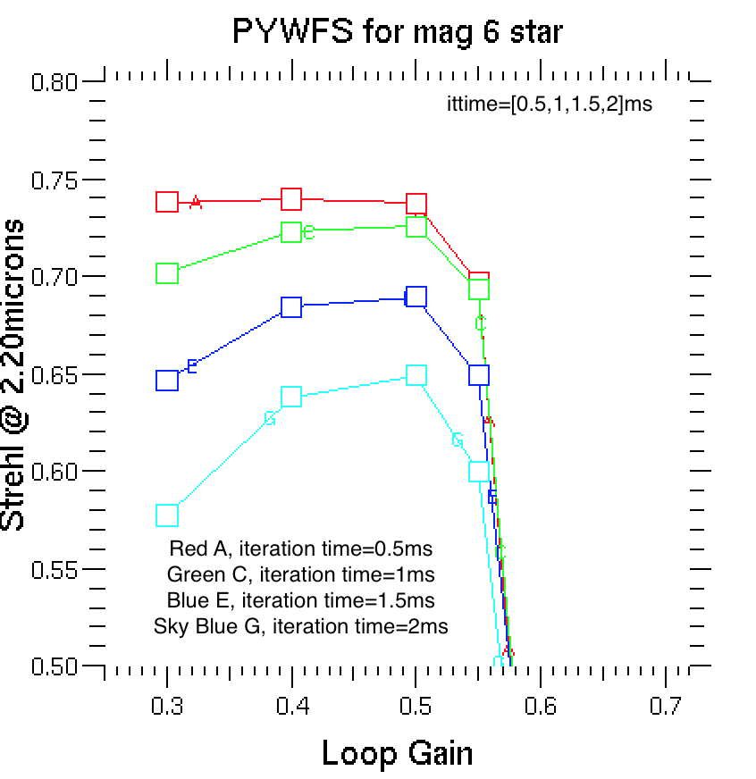
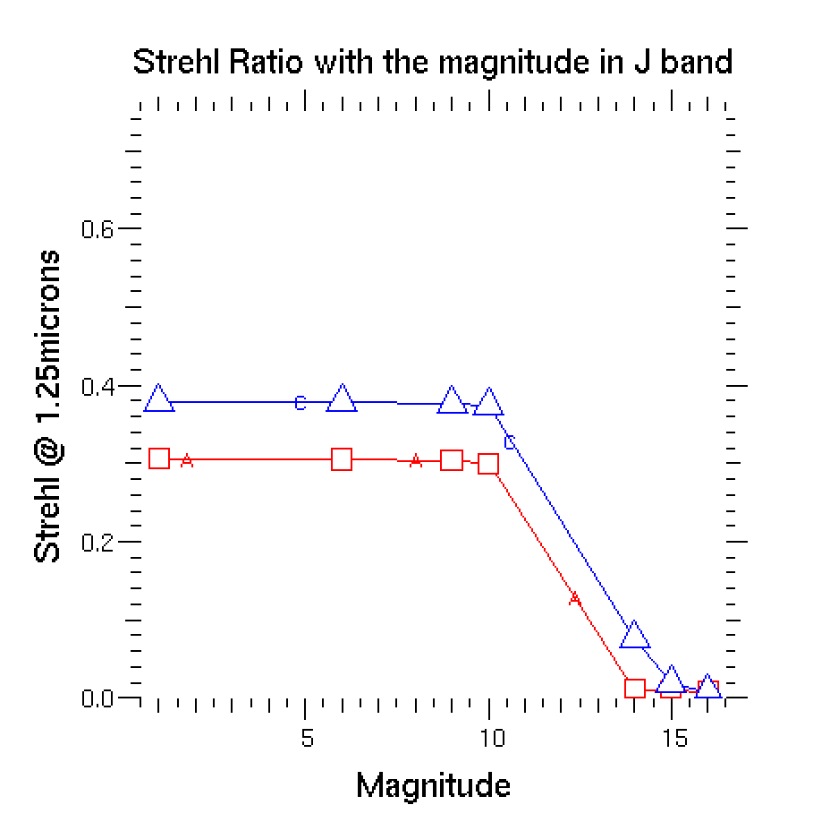
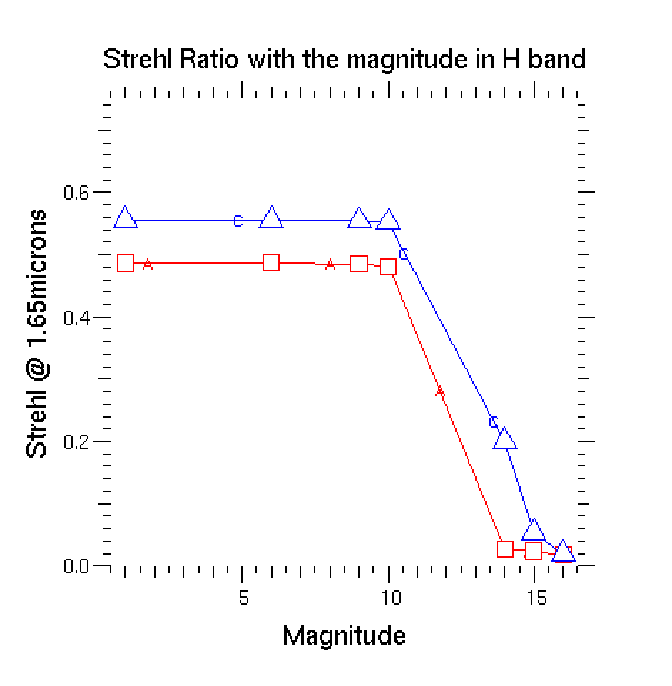
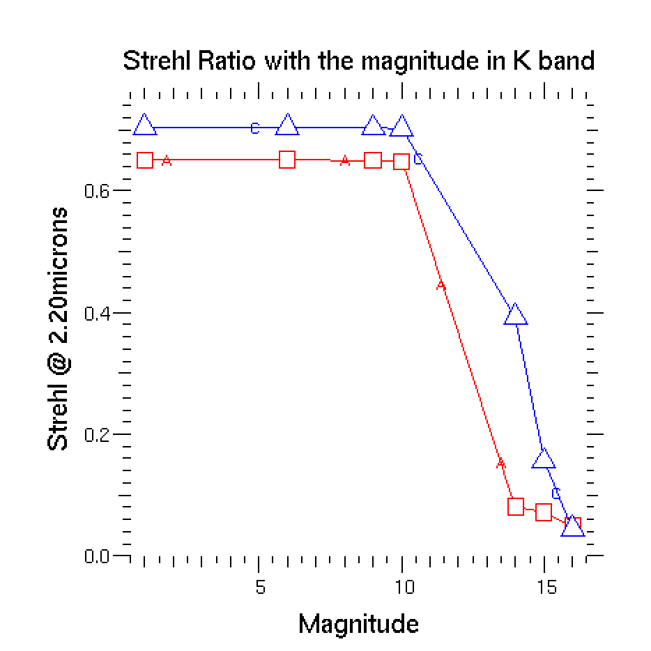

Using "YAO", a Monte-Carlo AO simulation tool, we develope a series of simulation tests.  The aim of the tests is to obtain the best-performed parameters of the Shack-Hartmann wavefront sensor and the Pyramid wavefront sensor and compare their performances, based on MMT adaptive optics system.  These two wavefront sensors are detecting the same field of view in R band(0.65 micron), with the camera working in J(1.25 micron), H(1.65 micron) and K(2.2micron) bands.

For testing the best-performed control system parameters, we made two sets of plots showing the relation of the Strehl ratio (peak value of the intensity from observation/theoretical peak of the intensity) and the loop gain, given different iteration times.  From the plot, we can see that for SHWFS, the best-performed results are obtained when the loop_gain= 0.3, iteration_time= 1 ms(given the limit of the control system); while for the pyramid wavefront sensor, the best-performed results are obtained when the loop_gain=0.5, iteration_time= 1 ms. The interpretation for this results is that Pyramid wavefront sensor requires higher amplification of the corrected signal than the Shack-Hartmann wavefront sensor. And in both cases, the faster the control system corrects the wavefront, the higher the Strehl Ratio will be, in which case, a faster-reacting control system is needed.

{width=25%}
{width=25%}
{width=25%}
{width=25%}

The setup of the pyramid wavefront sensor requires modulation, therefore, we make an extra testing on the modulation parameters of the pyramid wavefront sensor. The following images show the relation of the Strehl ratio and the modulation amplitude given different number of points on the modulation circle.  We choose the modulation amplitude with 0.1 and the number of points on the modulation circle to be 16 for K band, and modulation amplitude with 0.2 and the number of poitns on the modulation circle to be 24 for H band.  However, this result is just a supplement test to the optical design of the wavefront sensor, with the full results to be determined after considering the optical design as well.

{width=50%}
{width=50%}

For the comparison of the performance of 2 wavefront sensors, we made three plots showing the relation of the Strehl ratio and the magnitude of the star (triangles for the Pyramid wavefront sensor, and squares for the Shack-Hartmann wavefront sensor).  With the parameters given in the previous tests, we can conclude that in the region that the magnitude of the stars brighter than the 15 magnitude, the Pyramid wavefront sensor always outperforms the Shack-Hartmann wavefront sensor.

{width=33%}
{width=33%}
{width=33%}

The relation of the Strehl Ratio and the wavelength is :
$$  S \sim e^{-2\pi\omega^2}. $$
where $\omega = \delta/\lambda$ is the RMS wavefront error in units of the wavelength. Therefore, with the same wavefront error, the longer the wavelength is, the higher the strehl ratio will be.

